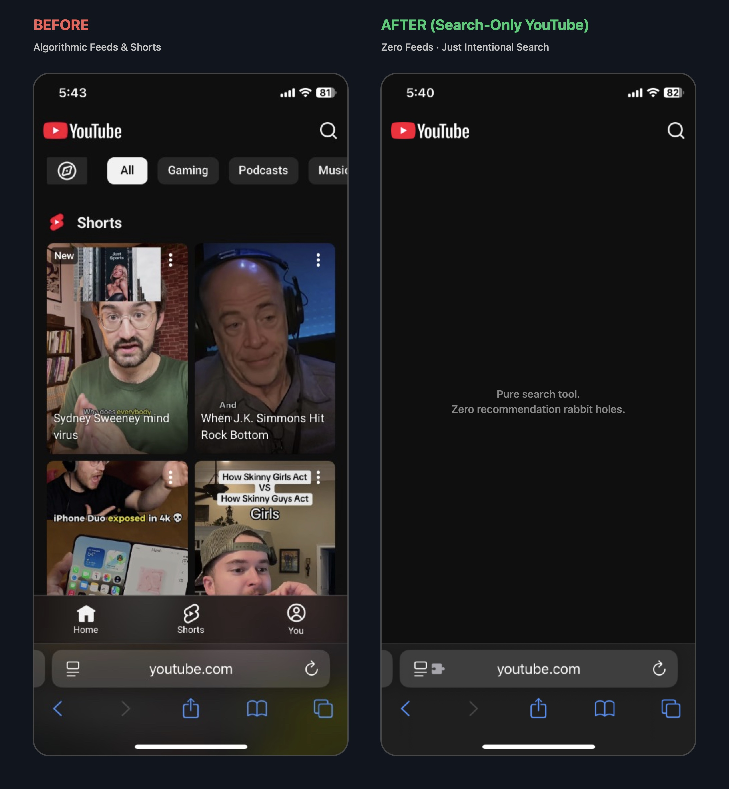

# Search-Only YouTube

A lightweight browser script that turns YouTube into a distraction-free search tool. It strips algorithmic feeds, removes sidebar recommendations, blocks Shorts, and kills autoplay countdowns on mobile and desktop.

Works in Mobile Safari (iOS), Firefox for Android, and desktop browsers.

  

---

### What it does

* **Clean Homepage:** Removes algorithmic video feeds from the homepage, leaving only YouTube's normal search bar.
* **No Shorts:** Redirects `/shorts/` links to the standard video player and hides Shorts shelves from search results.
* **Distraction-Free Watching:** Strips sidebar recommendations, up-next cards, and comments.
* **Kills Autoplay:** Stops the next video from playing automatically and removes the "Up next in..." countdown overlay.
* **Zero Settings:** No popups, configuration menus, or background tracking. If it is installed, it is on.

---

### Installation

#### iPhone / iPad (Mobile Safari)
1. Install **[Userscripts](https://apps.apple.com/app/userscripts/id1463298887)** from the App Store (free and open-source).
2. Enable it in **Settings > Safari > Extensions > Userscripts** (set permissions to **Always Allow**).
3. Open this link in Safari and tap **Install**:  
   👉 **[Install Search-Only YouTube](https://raw.githubusercontent.com/jakedarrow/SmartScreenTime/main/smart-screentime.user.js)**

#### Android (Firefox)
1. Install **[Firefox for Android](https://play.google.com/store/apps/details?id=org.mozilla.firefox)** from Google Play (free and open-source).
2. In Firefox, tap the three dots **⋮** > **Add-ons**, and tap **+** next to **Violentmonkey** (or **Tampermonkey**).
3. Open this link in Firefox and tap **Install**:  
   👉 **[Install Search-Only YouTube](https://raw.githubusercontent.com/jakedarrow/SmartScreenTime/main/smart-screentime.user.js)**

#### Desktop (Chrome / Brave / Arc / Edge / Firefox)
1. Install **Violentmonkey** or **Tampermonkey** from your browser's extension store.
2. Open the install link and confirm:  
   👉 **[Install Search-Only YouTube](https://raw.githubusercontent.com/jakedarrow/SmartScreenTime/main/smart-screentime.user.js)**  
*(Alternatively, Chrome users can load the unpacked `SmartScreenTime-Extension` folder via `chrome://extensions`).*

---

### Support

If Search-Only YouTube saved you time or helped you reclaim your focus, feel free to support the project:

---

### License
MIT
